# inventario-app — Trabajo Final CI/CD (Sistemas Distribuidos)

Catálogo de inventario con interfaz web y base de datos local, usado como base para construir un
pipeline de CI/CD completo: empaquetado en Docker, publicación automática vía GitHub Actions,
despliegue con rolling update, una segunda estrategia de despliegue (Blue-Green), y tres
componentes adicionales de buenas prácticas (manejo de secretos, escaneo de seguridad con Trivy,
y readiness con arranque lento).

Repo: https://github.com/jordyromero03/ExamenFinalDistribuidos

## Qué es la app

Una app Node.js/Express con:

- **Interfaz web** (`public/index.html`, `public/app.js`, `public/styles.css`): tabla de
  productos con formulario para agregar y botón para eliminar.
- **Base de datos local** (`db.js`): un archivo JSON en `data/products.json` que persiste los
  productos entre reinicios del proceso — sin motor de base de datos externo. **Sin volumen
  persistente montado**, este archivo vive dentro del filesystem de cada contenedor (ver
  sección "Persistencia de datos" más abajo).
- **API REST** consumida por la interfaz.

### Ejecutar en local

```bash
npm install
npm start
# abrir http://localhost:3000
```

### Pruebas

```bash
npm test
```

### Endpoints

| Método y ruta | Qué hace |
|---|---|
| `GET /health` | Estado de salud: `200` si el proceso terminó su arranque y la base de datos es accesible; `503` durante el arranque (ver `STARTUP_DELAY_SECONDS`); `500` si `SIMULATE_FAILURE=true` o la base no es accesible. |
| `GET /version` | Devuelve `version`, `color` y `hostname` — configurables por `APP_VERSION`/`APP_COLOR`. |
| `GET /api/products` | Lista todos los productos. |
| `GET /api/products/:id` | Devuelve un producto por id. |
| `POST /api/products` | Crea un producto (`name`, `sku`, `stock`, `price`). |
| `PATCH /api/products/:id` | Actualiza campos de un producto. |
| `DELETE /api/products/:id` | Elimina un producto. |
| `GET /` | Sirve la interfaz web. |

### Variables de entorno

| Variable | Por defecto | Para qué |
|---|---|---|
| `PORT` | `3000` | Puerto del servidor. |
| `APP_VERSION` | `v1` | Se muestra en `/version` y en el encabezado de la interfaz. |
| `APP_COLOR` | `blue` | Color del encabezado — distingue versiones en un despliegue. |
| `SIMULATE_FAILURE` | `false` | Si es `true`, `/health` responde siempre `500`. |
| `STARTUP_DELAY_SECONDS` | `0` | `/health` responde `503` ("starting") hasta que pasen estos segundos desde que arrancó el proceso — simula una conexión lenta a base de datos. |
| `API_KEY` | — | Credencial inyectada desde un `Secret` de Kubernetes vía `secretKeyRef` (ver sección "Manejo de secretos"). |
| `DB_PATH` | `./data/products.json` | Ruta del archivo de base de datos local. |

---

## Docker — build multi-stage

`Dockerfile` con dos etapas: `build` (instala dependencias, corre `npm test`, aborta el build si
falla) y `runtime` (imagen mínima, solo lo necesario para ejecutar, sin `npm` ni código de
test).

```bash
docker build -t inventario-app:local .
docker run -d --rm --name inventario-test -p 3000:3000 inventario-app:local

curl -i http://localhost:3000/
curl -s http://localhost:3000/health
curl -s http://localhost:3000/version
curl -s http://localhost:3000/api/products

docker inspect --format='{{json .State.Health}}' inventario-test
docker stop inventario-test
```

**Evidencia real:**

| Build (16/16, tests corriendo adentro) | `docker run` |
|---|---|
| 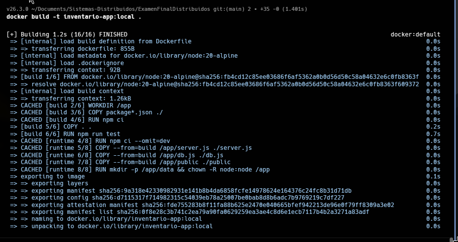 | 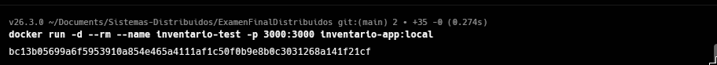 |

| `curl /` | `curl /health` | `curl /version` + `/api/products` |
|---|---|---|
| 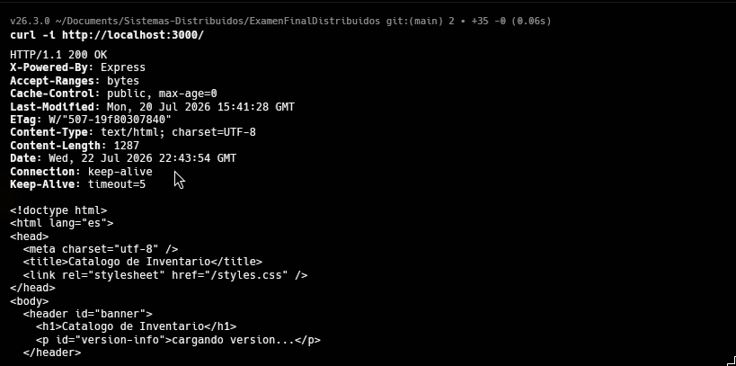 | 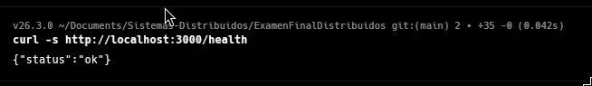 | 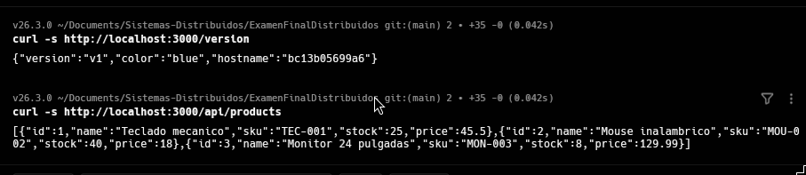 |

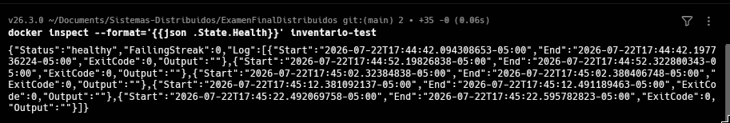

---

## CI/CD — GitHub Actions

`.github/workflows/ci-cd.yml`, dos jobs encadenados con `needs` (fail-fast: si `build-test`
falla, `build-push` ni siquiera arranca):

- **`build-test`**: `npm ci` + `npm test`.
- **`build-push`**: construye la imagen (sin publicar), la **escanea con Trivy**, y solo si el
  escaneo pasa, la publica en `ghcr.io` con dos tags: el hash del commit (`${{ github.sha }}`) y
  `latest`.

Se dispara en cada `push` a `main`. Verificación:

```bash
gh run list -R jordyromero03/ExamenFinalDistribuidos --limit 5
gh run view -R jordyromero03/ExamenFinalDistribuidos --log
```

> **Nota:** el nombre de imagen en `ghcr.io` va siempre en minúsculas
> (`jordyromero03/examenfinaldistribuidos`), aunque el repo de GitHub tenga mayúsculas — es un
> requisito de los registries Docker.

> **Gotcha:** la primera vez que se publica una imagen a un paquete nuevo en `ghcr.io`, suele
> quedar **privado** por defecto aunque el repo sea público. Minikube no puede hacer `pull` de
> una imagen privada sin credenciales. Verificar desde GitHub → perfil → **Packages** →
> `examenfinaldistribuidos` → **Package settings** → confirmar que la visibilidad sea
> **Public** (cambiarla ahí si no lo es). También se puede chequear por CLI, pero requiere que
> el token de `gh` tenga el scope `read:packages`:
> ```bash
> gh api /users/jordyromero03/packages/container/examenfinaldistribuidos --jq .visibility
> ```

---

## Kubernetes — Deployment base + Service (rolling update)

`k8s/deployment.yaml` (2 réplicas, `RollingUpdate` con `maxUnavailable`/`maxSurge` en 1,
`readinessProbe`/`livenessProbe` contra `/health`) y `k8s/service.yaml` (`NodePort`).

```bash
minikube start
kubectl apply -f k8s/deployment.yaml
kubectl apply -f k8s/service.yaml
kubectl rollout status deployment/inventario-app

URL=$(minikube service inventario-app --url)
curl -s $URL/health
curl -s $URL/version
curl -s $URL/api/products
```

Para promover un cambio nuevo (después de que el pipeline publique una imagen nueva):

```bash
kubectl rollout restart deployment/inventario-app
kubectl rollout status deployment/inventario-app
```

**Evidencia real (despliegue inicial):**

| `kubectl apply` + `rollout status` | Interfaz corriendo vía `minikube service` |
|---|---|
| 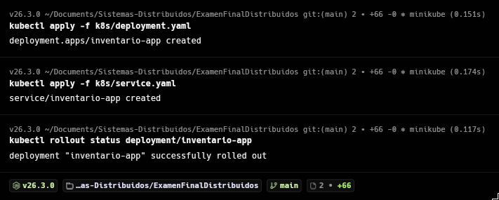 | 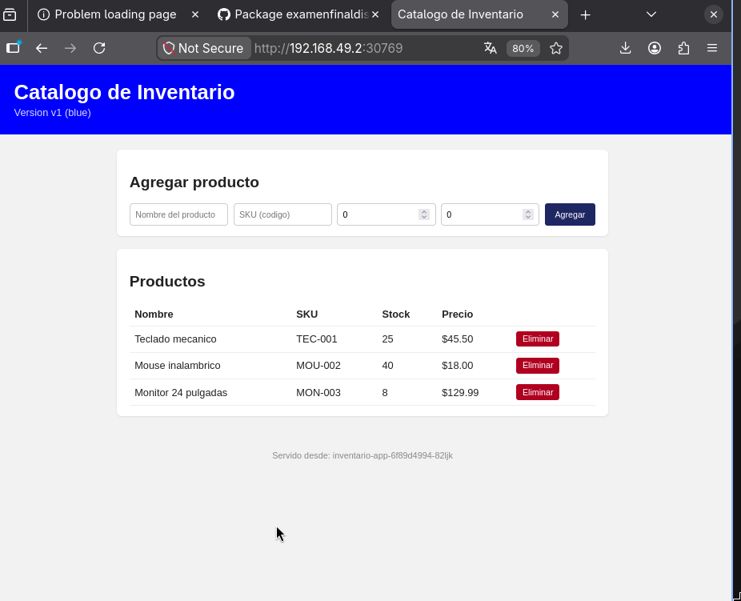 |

> **Nota sobre la label `slot: stable`:** los pods de este Deployment llevan además la label
> `slot: stable` (en `template.metadata.labels`), y el `selector` de `k8s/service.yaml` la
> exige también. Sin eso, como los pods de Blue-Green comparten la label `app: inventario-app`,
> el `Service` base terminaba repartiendo tráfico también hacia ellos — `slot: stable` separa
> limpiamente el Service base del de Blue-Green.

**Rolling update en acción** (un cambio real promovido, viendo rotar el `hostname` en
`/version` mientras el rollout avanza — usando la URL real del Service, que sí reparte tráfico
entre réplicas; a diferencia de `kubectl port-forward`, que se queda pegado a un solo pod y
nunca muestra rotación):

```bash
# Terminal 1 — loop contra la URL real del Service base
URL=$(minikube service inventario-app --url)
while true; do curl -s $URL/version; echo; sleep 1; done

# Terminal 2 — disparar el cambio real, en paralelo
kubectl rollout restart deployment/inventario-app
```

**Evidencia real:** el `hostname` rota de la generación vieja (`inventario-app-66597c6fb7-...`)
a los dos pods nuevos (`inventario-app-5c6bd7f857-zwvf7`/`-fjjhr`), alternando entre ambos una
vez que el rollout termina — sin ningún pod de Blue-Green mezclado:

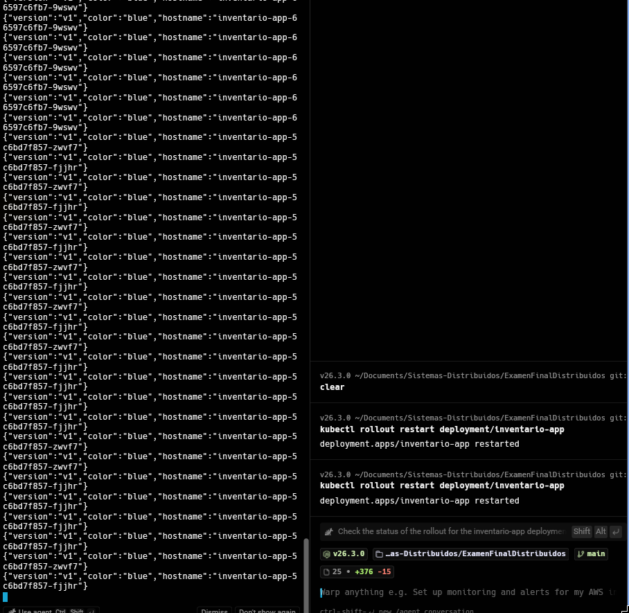

---

## Persistencia de datos — observación

Con **2 réplicas** y sin `PersistentVolume`, cada pod tiene su propia copia aislada de
`data/products.json`, sin sincronización entre ellas:

- Crear un producto y leerlo de inmediato puede dar resultados distintos según a qué pod te
  mande el `Service` en cada request (el catálogo puede "parpadear" entre réplicas).
- Si se borra un pod (`kubectl delete pod <nombre>`), el reemplazo arranca desde cero con los 3
  productos semilla — el dato creado en el pod viejo se pierde para siempre, porque vivía solo
  en la capa de escritura efímera de ese contenedor.

```bash
kubectl get pods -l app=inventario-app,slot!=blue,slot!=green
kubectl port-forward pod/<nombre-de-un-pod> 3001:3000
# en otra terminal, contra localhost:3001: crear un producto, confirmar, borrar el pod,
# port-forward al pod de reemplazo, y confirmar que volvió a los 3 productos semilla.
```

Es comportamiento esperado de esta app (JSON local sin volumen), no un bug — documentado en el
informe de la Parte II.

---

## Segunda estrategia de despliegue — Blue-Green

Justificación (ampliada en el informe): app de bajo tráfico sin usuarios reales, donde interesa
demostrar un corte de tráfico **instantáneo y verificable** en vez de un reparto gradual.

`k8s/blue-green/`: dos Deployments completos (`inventario-app-blue` con `APP_VERSION=v1`/
`APP_COLOR=blue`, `inventario-app-green` con `v2`/`green`), mismo label `app: inventario-app`
más un `slot` distinto, y un `Service` (`inventario-app-bluegreen`) cuyo `selector` apunta a un
slot a la vez.

```bash
kubectl apply -f k8s/blue-green/deployment-blue.yaml
kubectl apply -f k8s/blue-green/deployment-green.yaml
kubectl apply -f k8s/blue-green/service.yaml

BG_URL=$(minikube service inventario-app-bluegreen --url)

echo "--- ANTES (blue) ---"
curl -s $BG_URL/version

kubectl patch service inventario-app-bluegreen \
  -p '{"spec":{"selector":{"slot":"green"}}}'

echo "--- DESPUES (green) ---"
curl -s $BG_URL/version
```

El corte es instantáneo: al cambiar el `selector` del `Service`, Kubernetes recalcula sus
`Endpoints` casi de inmediato — no hay rolling update ni ventana de transición.

**Evidencia real:**

| `apply` blue | `apply` green + Service |
|---|---|
| 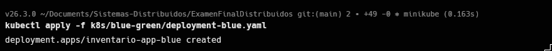 | 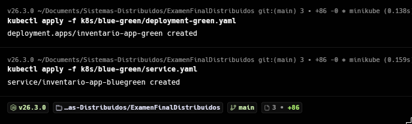 |

**Antes** del corte (`curl $BG_URL/version` con el selector en `blue`):

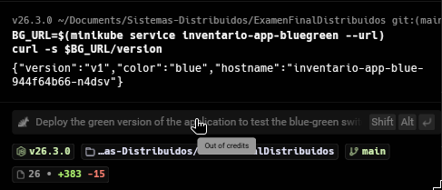

**Después** del corte — `kubectl patch` cambiando el selector a `green`, y el `curl`
confirmándolo:

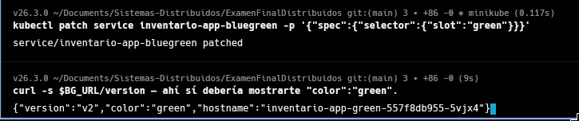

Confirmación de que `blue` sigue vivo después del corte (solo dejó de recibir tráfico del
Service, no se borró):

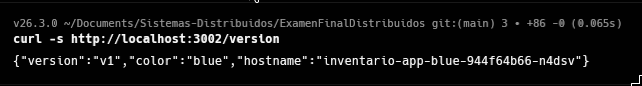

---

## Componentes adicionales de buenas prácticas

### 1. Manejo de secretos

Una credencial ficticia (`API_KEY`) se crea como `Secret` de Kubernetes **a mano** (nunca en un
archivo versionado) y se inyecta vía `secretKeyRef`. Se versiona solo una plantilla de ejemplo,
`k8s/secret.example.yaml`, con un valor placeholder.

```bash
kubectl create secret generic inventario-secrets --from-literal=API_KEY=demo-api-key-12345
kubectl apply -f k8s/deployment.yaml
kubectl rollout status deployment/inventario-app

# Evidencia 1: el valor SI llega a la app
kubectl get pods -l app=inventario-app,slot!=blue,slot!=green
kubectl exec <nombre-de-pod> -- printenv API_KEY

# Evidencia 2: el valor NUNCA quedo en un archivo versionado
git log --all -p | grep -i "demo-api-key-12345" && echo "ENCONTRADO (mal)" || echo "NO encontrado (correcto)"
```

**Evidencia real:**

| Crear Secret + aplicar + rollout | `printenv` + `git grep` |
|---|---|
| 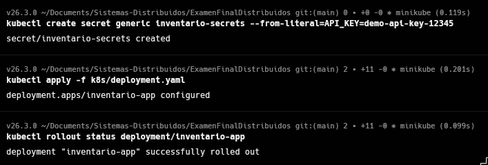 | 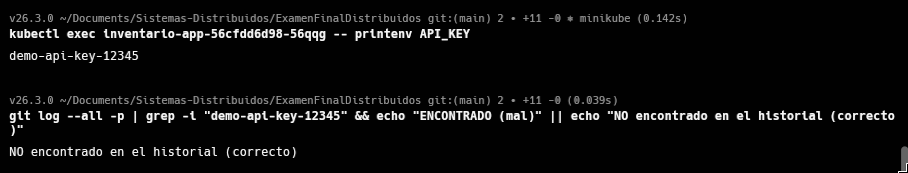 |

### 2. Readiness con arranque lento

`STARTUP_DELAY_SECONDS` (env var) hace que `/health` responda `503` ("starting") durante los
primeros N segundos después de arrancar, simulando una conexión lenta a una base de datos. El
`readinessProbe` de `k8s/deployment.yaml` está ajustado (`initialDelaySeconds: 5`,
`periodSeconds: 3`, `failureThreshold: 6` — hasta ~23s de margen) para tolerar ese arranque sin
que Kubernetes mate el pod.

```bash
kubectl rollout restart deployment/inventario-app; kubectl get pods -l app=inventario-app,slot!=blue,slot!=green -w
```

Los pods nuevos quedan en `0/1` (no `Ready`) durante ~15 segundos, sin reiniciarse, y luego pasan
a `1/1 Running`.

**¿Y si en vez de ajustar el probe se aumentan las réplicas?** No resuelve nada: el arranque
lento es una propiedad de cada pod individual, no algo que se diluya entre más instancias. Más
réplicas solo significan más pods tardando exactamente lo mismo en estar listos, consumiendo más
recursos sin acelerar el momento en que cualquiera puede empezar a servir tráfico.

**Evidencia real (uno de los intentos fallidos durante la depuración — ver problemas reales
encontrados en el informe):** pods pasando de `0/1` a `1/1` en pocos segundos, antes de que la
variable `STARTUP_DELAY_SECONDS` estuviera realmente aplicada en la imagen:

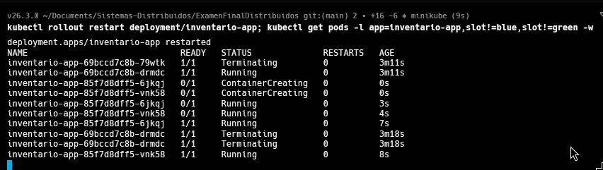

**Evidencia real (caso final, con el fix completo):** los pods nuevos (`inventario-app-68c675c96b-*`)
se quedan en `0/1` desde el segundo 0 hasta pasar a `1/1` recién a los 18-19 segundos —
coincide con los ~15s de `STARTUP_DELAY_SECONDS` más el margen del `readinessProbe`:

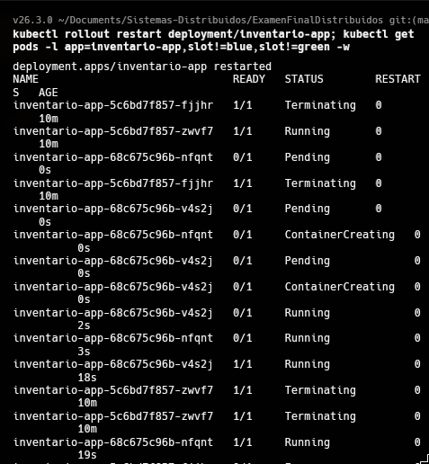

### 3. Escaneo de seguridad con Trivy

Paso en el job `build-push` del workflow: construye la imagen localmente, la escanea con
`aquasecurity/trivy-action`, y falla el pipeline (`exit-code: 1`) si encuentra vulnerabilidades
`CRITICAL`. Solo si el escaneo pasa, se publica la imagen.

```bash
gh run view -R jordyromero03/ExamenFinalDistribuidos <run-id> --log
```

Evidencia real capturada durante la construcción de este componente: bajar `express` a
`4.17.1` a propósito hizo fallar el pipeline con `CVE-2026-59873` (`CRITICAL`) en `tar`
(dependencia transitiva) — corregido revirtiendo `express`. También se encontró un `CRITICAL`
independiente (`tar` empaquetado dentro del propio `npm` de la imagen base `node:20-alpine`,
no relacionado con las dependencias de la app) — corregido eliminando `npm` de la imagen final
en el `Dockerfile`, ya que no hace falta en tiempo de ejecución.

**Evidencia real — de rojo a verde:**

| Run fallido (tag de la acción mal escrito) | Trivy corriendo de verdad | Run final en verde |
|---|---|---|
| 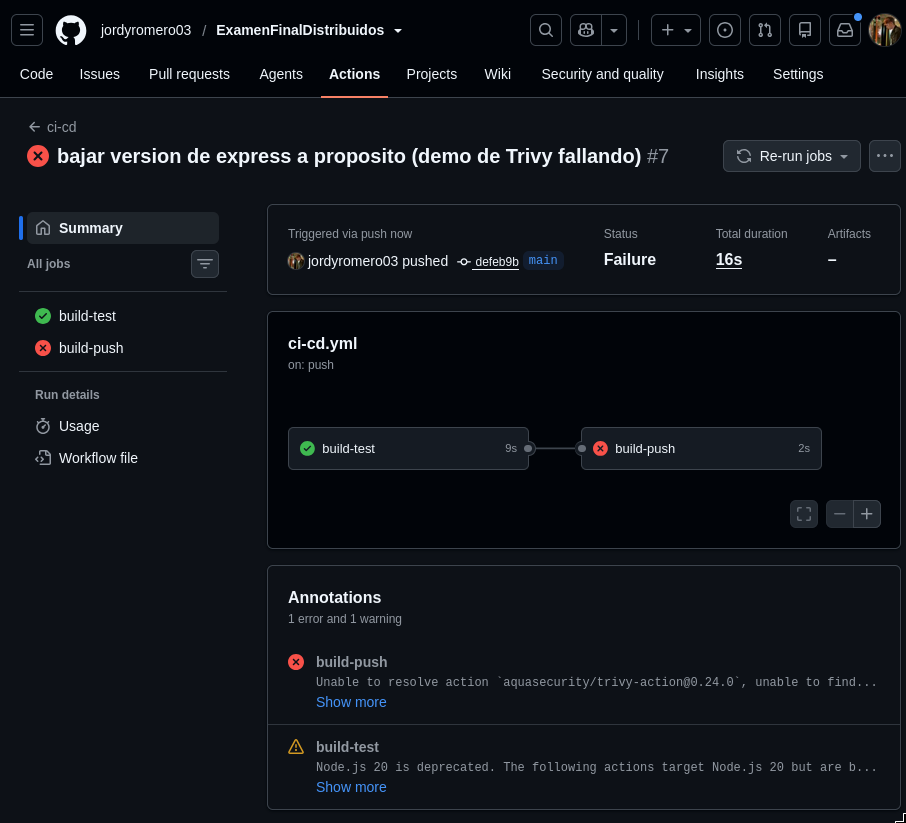 | 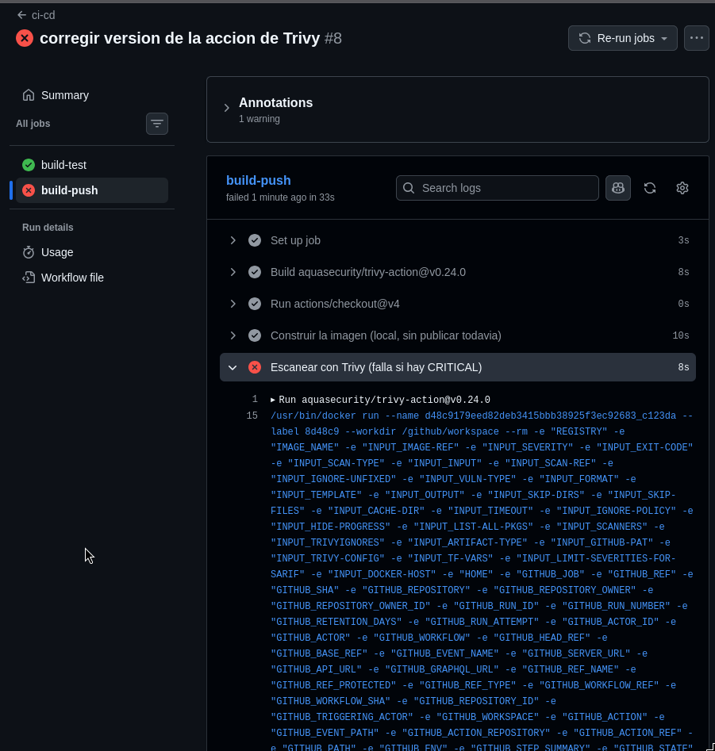 | 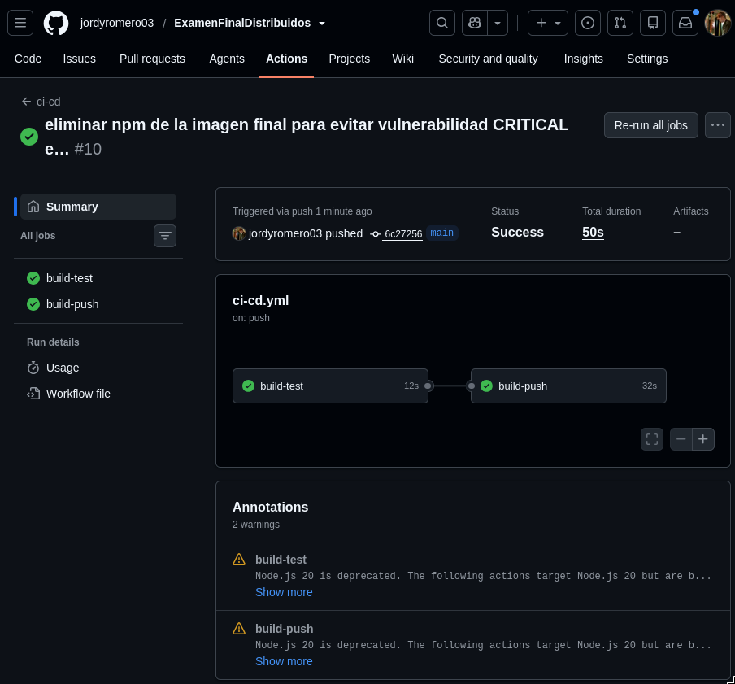 |

---

## Métricas DORA y bitácora de despliegues

Ver `docs/deploy-log.md` para la bitácora de cada despliegue real (commit → pipeline → aplicado
al clúster) y el informe en PDF (Parte II) para los 3 números DORA (lead time, frecuencia de
despliegue, change failure rate) calculados a partir de esos datos, junto con la justificación
de la estrategia elegida y los problemas reales encontrados durante el trabajo.

**Evidencia real del segundo lead time** (commit `6c27256` → `rollout restart` confirmado):

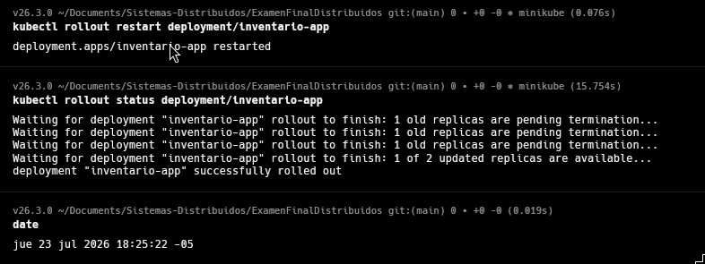
